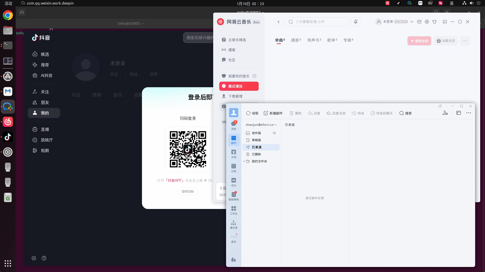

# Wine-Docker

一个基于 Docker 和 Deepin-Wine 的 Windows 应用运行环境，专为 Linux 系统设计。支持企业微信、微信、网易云音乐等数 Windows 应用程序在 Linux 上流畅运行。



*截图展示：抖音、网易云音乐、邮件客户端等多应用同时运行*

## ✨ 主要特性

- 🐳 **完全容器化** - 基于 Docker 的隔离环境，不影响宿主机系统
- 🚀 **一键运行** - 智能脚本自动处理环境配置和应用安装
- 📦 **应用管理** - 支持安装、卸载、搜索、列出数百款应用
- 🎨 **图形界面支持** - 完整的 X11 转发，完美支持 GUI 应用
- 💾 **数据持久化** - 应用数据自动保存到宿主机，容器重建不丢失
- 🔧 **自动化配置** - 自动配置 Docker、Wine、输入法等环境
- 🌐 **网络支持** - 支持 host 网络模式，应用网络功能正常

## 📋 目录

- [快速开始](#快速开始)
- [应用管理](#应用管理)
- [项目结构](#项目结构)
- [配置说明](#配置说明)
- [使用示例](#使用示例)
- [故障排除](#故障排除)
- [开发指南](#开发指南)

## 🚀 快速开始

### 系统要求

- **操作系统**: Linux ( Ubuntu 20.04 与 Ubuntu 22.04都测试过)
- **Docker**: 20.10+ 
- **内存**: 至少 4GB RAM
- **磁盘空间**: 至少 5GB 可用空间
- **图形环境**: X11 或 Wayland (需要图形界面支持)

### 安装步骤

1. **克隆项目**
   ```bash
   git clone https://github.com/zwhy2025/linux-wxwork.git
   cd linux-wxwork
   ```

2. **运行应用（推荐）**
   
   使用简短名称运行应用，脚本会自动安装和配置：
   ```bash
   ./tools/run.sh wxwork    # 运行企业微信
   ./tools/run.sh wechat    # 运行微信
   ./tools/run.sh netease   # 运行网易云音乐
   ```
   
   首次运行会自动执行：
   - 检查并安装系统依赖（curl, jq, docker 等）
   - 配置 Docker 镜像源
   - 构建或拉取 Docker 镜像
   - 创建并启动容器
   - 安装并运行指定应用

3. **查看可用应用**
   ```bash
   ./tools/app.sh list      # 列出所有支持的应用
   ./tools/app.sh search <关键词>  # 搜索应用
   ```

### 💡 其他选择

> **提示**: 如果您更喜欢传统的虚拟机方案，也可以考虑使用 **VirtualBox + Windows 10 精简版镜像** 的方式运行 Windows 应用。
> 
> **优势**:
> - ✅ 原生 Windows 环境，兼容性最佳
> - ✅ 镜像体积小（最小的Windows 10 精简版镜像约 1.4GB），资源占用低
> - ✅ 完全隔离，安全性高
> - ✅ 支持所有 Windows 应用，无兼容性问题
> 
> **资源占用对比**:
> - Wine-Docker: 内存占用约 500MB-1GB，磁盘约 2-3GB
> - VirtualBox + Win10: 内存占用约 1-2GB，磁盘约 3-5GB（含镜像）
> 
> 两种方案各有优势，您可以根据自己的需求选择。Wine-Docker 方案更轻量、启动更快；虚拟机方案兼容性更好、功能更完整。

## 📦 应用管理

### 安装应用

**方式一：使用简短名称（推荐）**
```bash
./tools/run.sh <简短名称>
```
例如：`./tools/run.sh wxwork` 会自动安装并运行企业微信

**方式二：使用应用管理脚本**
```bash
# 安装应用
./tools/app.sh install <完整包名> [简短名称]

# 示例
./tools/app.sh install com.qq.weixin.work.deepin wxwork
```

### 卸载应用

```bash
./tools/app.sh uninstall <包名或简短名称>

# 示例
./tools/app.sh uninstall wxwork
./tools/app.sh uninstall com.qq.weixin.work.deepin
```

### 搜索应用

从 [Deepin-Wine 应用商店](https://deepin-wine.i-m.dev/) 搜索可用应用：

```bash
./tools/app.sh search wechat    # 搜索包含 "wechat" 的应用
./tools/app.sh search 音乐      # 搜索音乐相关应用
```

### 列出所有应用

查看项目中已配置的热门应用列表：

```bash
./tools/app.sh list
```

### 应用管理命令帮助

```bash
./tools/app.sh help
```

## 📁 项目结构

```
linux-wxwork/
├── env/                          # 环境安装脚本
│   ├── install_base.sh          # 基础系统包安装
│   ├── install_dev.sh           # 开发工具安装
│   ├── install_graphics.sh      # 图形界面支持
│   ├── install_spark_store.sh   # Spark Store 补丁包安装
│   ├── install_wxwork.sh        # 企业微信安装（示例）
│   └── setup_env.sh             # 环境设置
├── tools/                        # 工具脚本
│   ├── app.sh                   # 应用管理脚本（安装/卸载/搜索/列出）
│   ├── run.sh                   # 统一运行脚本（自动安装+运行）
│   ├── run_wxwork.sh            # 企业微信快捷脚本（兼容性）
│   ├── setup.sh                 # 环境依赖检查和安装
│   └── functions.bash           # 公共函数库
├── wxwork-files/                 # 应用数据目录（自动创建）
│   ├── [用户ID]/                 # 用户数据
│   │   ├── Data/                # 应用数据
│   │   ├── Cache/               # 缓存文件
│   │   ├── Backup/              # 备份数据
│   │   └── WeDrive/             # 企业网盘
│   ├── Global/                  # 全局配置
│   └── Profiles/                # 用户配置文件
├── mapping.json                 # 应用映射表（简短名称 ↔ 包名）
├── docker-compose.yml           # Docker Compose 配置
├── Dockerfile                   # Docker 镜像构建文件
└── README.md                    # 项目说明文档
```

## ⚙️ 配置说明

### Docker Compose 配置

主要配置项：

- **镜像**: `zwhy2025/wine-docker:base`
- **容器名**: `wine_container`
- **网络模式**: `host` (共享主机网络)
- **特权模式**: 启用 (用于设备访问)
- **共享内存**: 16GB
- **工作目录**: `/workspace`

### 卷挂载

- `.:/workspace` - 项目目录挂载
- `./wxwork-files:/root/.deepinwine/.../WXWork/` - 应用数据持久化
- `${HOME}/.Xauthority:/root/.Xauthority` - X11 认证
- `/tmp:/tmp` - 临时文件共享
- `/dev:/dev` - 设备访问

### 环境变量

- `DISPLAY` - X11 显示服务器
- `QT_X11_NO_MITSHM=1` - 禁用 MIT-SHM 扩展
- `ACCEPT_EULA=Y` - 接受最终用户许可协议
- `PRIVACY_CONSENT=Y` - 隐私协议同意
- `XDG_RUNTIME_DIR` - XDG 运行时目录

## 💡 使用示例

### 运行企业微信

```bash
# 方式一：使用快捷脚本
./tools/run.sh wxwork

# 方式二：使用完整命令
./tools/app.sh install com.qq.weixin.work.deepin wxwork
./tools/run.sh wxwork
```

### 运行微信

```bash
./tools/run.sh wechat
```

### 运行网易云音乐

```bash
./tools/run.sh netease
```

### 搜索并安装新应用

```bash
# 1. 搜索应用
./tools/app.sh search 音乐

# 2. 查看搜索结果，找到包名
# 3. 安装应用
./tools/app.sh install <包名> <简短名称>

# 4. 运行应用
./tools/run.sh <简短名称>
```

### 查看帮助信息

```bash
# 应用管理帮助
./tools/app.sh help

# 运行脚本帮助
./tools/run.sh
```

## 🔍 故障排除

### 常见问题

#### 1. 图形界面无法显示

**问题**: 应用启动后看不到窗口

**解决方案**:
```bash
# 允许 X11 连接
xhost +local:docker

# 检查 DISPLAY 变量
echo $DISPLAY

# 如果为空，设置 DISPLAY
export DISPLAY=:0
```

#### 2. 容器无法启动

**问题**: Docker 容器启动失败

**解决方案**:
```bash
# 检查 Docker 服务状态
sudo systemctl status docker

# 重启 Docker 服务
sudo systemctl restart docker

# 检查容器日志
docker logs wine_container
```

#### 3. 应用安装失败

**问题**: 安装应用时出现错误

**解决方案**:
```bash
# 检查容器是否运行
docker ps | grep wine_container

# 进入容器检查
docker exec -it wine_container bash

# 手动更新软件源
docker exec wine_container apt update

# 检查网络连接
docker exec wine_container ping -c 3 8.8.8.8
```

#### 4. 输入法无法使用

**问题**: 容器内无法输入中文

**解决方案**:
```bash
# 检查输入法环境变量（已在 wrapper 中自动设置）
docker exec wine_container env | grep IM_MODULE

# 如果未设置，手动设置
docker exec -it wine_container bash
export GTK_IM_MODULE=fcitx
export QT_IM_MODULE=fcitx
export XMODIFIERS=@im=fcitx
```

#### 5. 数据丢失

**问题**: 容器重建后应用数据丢失

**解决方案**:
- 确保 `wxwork-files/` 目录存在且可写
- 检查 docker-compose.yml 中的卷挂载配置
- 检查文件权限：`ls -la wxwork-files/`

### 日志查看

```bash
# 容器日志
docker logs wine_container

# 实时查看容器日志
docker logs -f wine_container

# 应用日志（企业微信示例）
docker exec wine_container find /root/.deepinwine -name "*.log" -type f

# 查看 wrapper 调试日志
cat .cursor/debug.log
```

### 重置环境

如果遇到无法解决的问题，可以重置环境：

```bash
# 停止并删除容器
docker compose down

# 删除镜像（可选）
docker rmi zwhy2025/wine-docker:base

# 清理数据（谨慎操作，会删除所有应用数据）
# rm -rf wxwork-files/

# 重新运行
./tools/run.sh wxwork
```

## 🛠️ 开发指南

### 进入容器调试

```bash
# 进入运行中的容器
docker exec -it wine_container bash

# 查看 Wine 配置
winecfg

# 查看已安装的应用
dpkg -l | grep deepin

# 查看应用进程
ps aux | grep -E "wxwork|wechat|netease"

# 手动运行应用
/usr/bin/wxwork
```

### 添加新应用

1. **查找应用包名**
   ```bash
   ./tools/app.sh search <关键词>
   ```

2. **安装应用**
   ```bash
   ./tools/app.sh install <包名> <简短名称>
   ```

3. **添加到映射表** (可选)
   
   编辑 `mapping.json`，添加新应用的映射：
   ```json
   {
     "简短名称": {
       "package": "完整包名",
       "description": "应用描述"
     }
   }
   ```

### 构建 Docker 镜像

```bash
# 本地构建镜像
docker buildx build --platform linux/amd64 -t zwhy2025/wine-docker:base --load .

# 使用 docker-compose 构建
docker compose build

# 构建并启动
docker compose up -d --build
```

### 修改环境配置

编辑 `env/` 目录下的脚本文件，然后重新构建镜像：

```bash
# 修改脚本后重新构建
docker compose build --no-cache
docker compose up -d
```

## 📝 注意事项

1. **数据安全**: `wxwork-files/` 目录包含用户数据，请定期备份
2. **权限问题**: 容器以特权模式运行，注意安全风险
3. **资源占用**: 某些应用可能占用较多内存和 CPU 资源
4. **网络访问**: 使用 host 网络模式，注意防火墙设置
5. **X11 安全**: `xhost +local:docker` 会降低 X11 安全性，仅在受信任环境使用

## 🤝 贡献指南

欢迎提交 Issue 和 Pull Request 来改进这个项目！

### 贡献方式

1. Fork 本项目
2. 创建特性分支 (`git checkout -b feature/AmazingFeature`)
3. 提交更改 (`git commit -m 'Add some AmazingFeature'`)
4. 推送到分支 (`git push origin feature/AmazingFeature`)
5. 开启 Pull Request

### 报告问题

提交 Issue 时请包含：
- 操作系统版本
- Docker 版本
- 错误日志
- 复现步骤

## 📄 许可证

本项目遵循相应的开源许可证。

## 🙏 致谢

- 基于 [deepin-wine](https://github.com/zq1997/deepin-wine) 项目
- 应用来源：[Deepin-Wine 应用商店](https://deepin-wine.i-m.dev/)

## 🆘 获取帮助

如果遇到问题：

1. 查看 [故障排除](#故障排除) 部分
2. 搜索已有的 [Issues](https://github.com/zwhy2025/linux-wxwork/issues)
3. 提交新的 Issue 并附上详细信息和日志

---

**免责声明**: 本项目仅用于学习和研究目的，请遵守相关软件的使用协议。使用本项目运行的应用需遵守其各自的许可协议。
